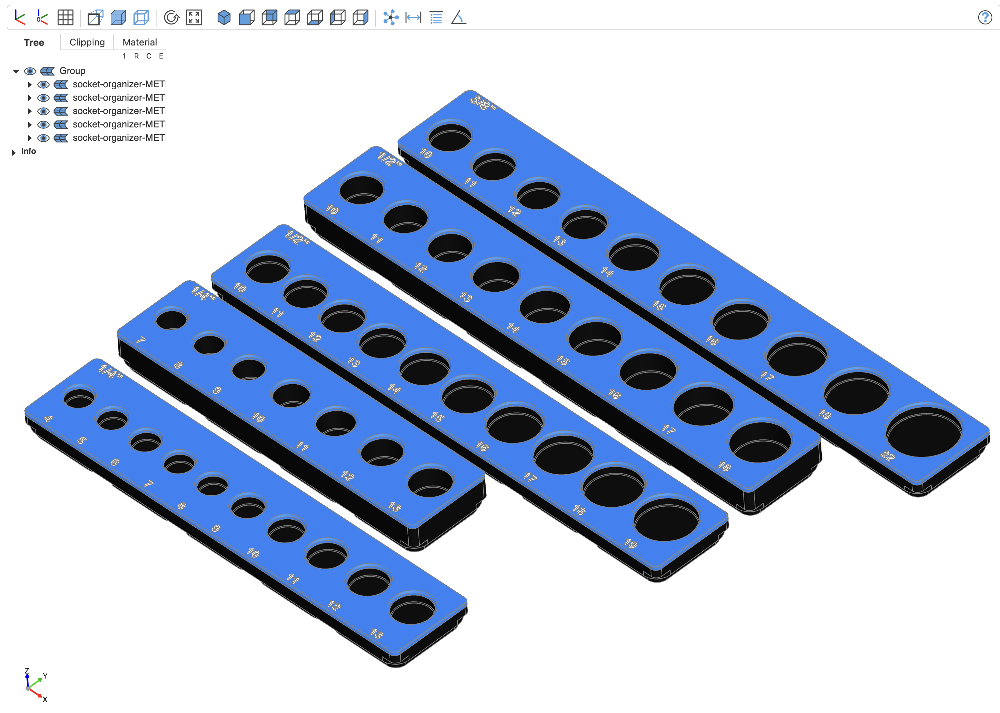
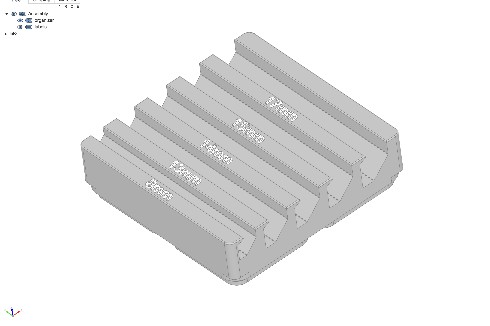

# Thingsmith




Thingsmith is a Python library for generating parametric 3D printable models
using [Build123D](https://build123d.readthedocs.io/) that can be easily modified
and exported to STL files.

This project is incomplete, more models may be added based on personal needs.

## Features

- **Socket Organizers**: Generate organizers for drive sockets
- **Wrench Organizers**: Create organizers for wrenches
- **3D Visualization**: Support for OCP-vscode for real-time 3D model viewing
- **STL Export**: Direct export to STL files ready for 3D printing

## Installation

Thingsmith requires Python 3.10-3.12.

No Python module is available, but it can be installed from Git:

```sh
uv add git+ssh://git@github.com/davidharrigan/thingsmith.git
```

## Quick Start

See the [example](./example/) directory for examples.

### Generate Socket Organizers

`SocketBuilder` can define the type and dimension of sockets for the organizer.

```python
from thingsmith import drive_socket as socket

# I want an organizer for 1/4" drive mm sockets.
builder = socket.SocketBuilder().drive(socket.DriveSize.QUARTER_INCH)
sockets = [
    builder.metric(5).diameter(11.9).build(),
    builder.metric(6).diameter(11.9).build(),
    builder.metric(7).diameter(11.9).build(),
    builder.metric(8).diameter(11.9).build(),
    builder.metric(9).diameter(13.1).build(),
    builder.metric(10).diameter(14.6).build(),
]
```

Use `socket.Organizer` and `socket.OrganizerSpec` to build and customize the organizer.

```python
def make_spec(sockets: list[socket.Socket], socket_type: socket.SocketType) -> socket.OrganizerSpec:
    depth = 6

    # adjust depth for deep sockets
    if sockets[0] & socket.SocketType.DEEP:
        depth = 12

    return socket.OrganizerSpec(
        sockets,
        base_height=depth,
        insert_depth=depth,
        organizer_label=str(socket.DriveSize.QUARTER_INCH),
    )

# build organizer for short and deep sockets that come in the same size and diameter.
short = socket.Organizer(make_spec(sockets, socket.SocketType.STANDARD)
deep = socket.Organizer(make_spec(sockets, socket.SocketType.DEEP)
```

To export them as STL files:

```python
from build123d import export_stl

export_stl(short, f"./stl/{short.name}.stl")
export_stl(deep, f"./stl/{deep.name}.stl")
```

To view a live 3D model, `ocp_vscode` is required.

First, run the ocp_vscode server. You can install the VSCode extension, or from terminal:

```bash
# Start ocp server and open http://127.0.0.1:3939/viewer.
uv run -m ocp_vscode
```

Then, import `ocp_vscode` to show the 3D models:

```python
from ocp_vscode import show_object

show_object(short)
```
